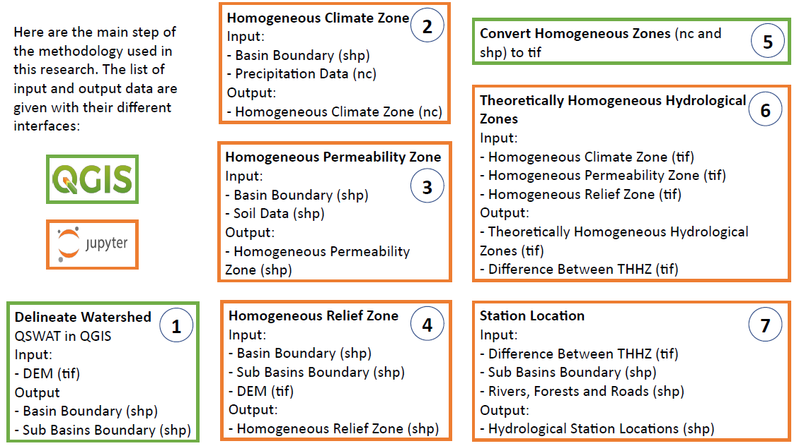

# optimization-hydrologic-station-network
Optimization of a Network of Hydrometric Stations: Case of the Sota River Basin, Benin

## Data

The table below presents the datasets used in this research.

| Description | Format | Reference |
| --- | --- | --- |
| Topographic data: CGIAR-CSI global digital elevation model (SRTM 90m database) | Tag Image File Format (TIF) | Reuter H.I., Nelson A., Jarvis A. (2007) |
| Precipitation data: CHIRPS global and spatially distributed daily precipitation data from 1981 to 2010 | NetCDF4 (NC) | Funk C., Peterson P., Landsfeld M. et al. (2015) |
| Soil data: ORSTOM spatially distributed soil data in Benin | Shapefile (SHP) | ORSTOM (1978) |
| River, forest and road data: IGN shapefiles | Shapefile (SHP) | IGN (2002) |
| Metadata of hydrometric stations: coordinates and installation date | Texte (TXT) | DG-EAU (2008) |

CGIAR-CSI: Consortium for Spatial Information, CHIRPS: Climate Hazards group Infrared Precipitation with Stations, DGEAU: Direction Générale de l’Eau, IGN: Institut Géographique National, ORSTOM: Overseas Scientific and Technical Research Office

## Description of the notebooks

The notebooks should be viewed in the following order:
- [Download CHIRPS data on SRB](./0_download_sota_chirps_data.ipynb): downloads CHIRPS precipitation data and clips it over the study area with Google Colab
- [Homogeneous Climate Zone](./1_homogeneous_climate_zone.ipynb): determines the homogeneous climate zones
- [Homogeneous Permeability Zone](./2_homogeneous_permeability_zone.ipynb): determines the homogeneous permeability zones
- [Homogeneous Relief Zone](./3_homogeneous_relief_zone.ipynb): determines the homogeneous relief zones
- [Theoretically Homogeneous Hydrological Zones](./4_homogeneous_hydrological_zones.ipynb): determines the theoretically homogeneous hydrological zones
- [Station Location](./5_station_location.ipynb): suggests locations for new hydrometric stations
- [Other](./6_other.ipynb): justifies the optimization step and calculates the percentage of forest

## Methodology



## Anaconda Environment

Install local environment using an Anaconda Prompt:

```
conda env create pyaj/GIS
```

Or download environment requirements [here](https://anaconda.org/Pyaj/GIS/2022.03.24.074655/download/GIS.yml)


